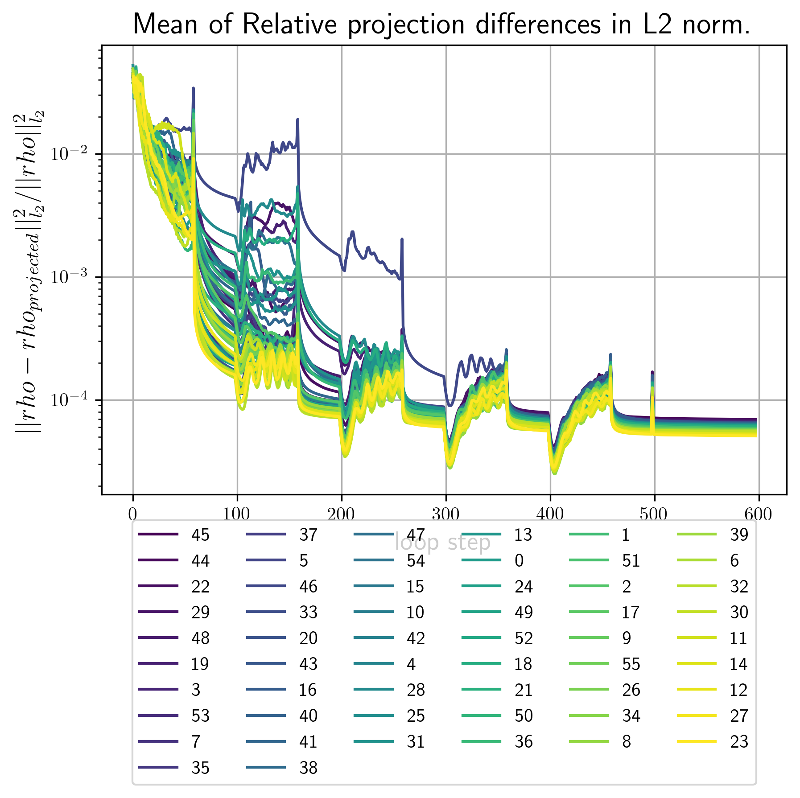

# Getting Started
The following section walks you through the fxs workflow.
First lets setup the xframe home directory by calling:
```console
$ xframe --setup_home HOME_PATH
```
and substituting `HOME_PATH` with where ever you want xframe to store files by default, if no value for `HOME_PATH` is given `~/.xframe` will be used. 

??? note "Short version of getting started"
	If you are willing to skip first step of extracting correlations from scattering patterns, the short version of this tutorial consists of executing the commands	
	```console
	$ xframe fxs simulate_ccd tutorial
	$ xframe fxs extract tutorial
	$ xframe fxs reconstruct tutorial
	$ xframe fxs average tutorial
	```
	 and looking at the data outputed to 'HOME_PATH/data/fxs/'.
	
	- `xframe fxs simulate_ccd` generates a cross-correlation dataset
	- `xframe fxs extract` extracts the single-particle rotational invariants.
	- `xframe fxs reconstruct` runs phase retrieval using the computed invariants
	- `xframe fxs average` averages a set of provided reconstructions
			
	You want it all in one command? No problem!  
	*xFrame* supports command chaining so you can equivalently just call
	```
	$ xframe fxs simulate_ccd tutorial extract tutorial reconstruct tutorial average tutorial
	```
	
	Note if you are running these scripts on a machine with less than 4 physical cpu cores you will have to run
	```console
	$ xframe fxs reconstruct tutorial
	```
	twice and change the settings for the `average` command at  `HOME_PATH/settings/projects/fxs/average/tutorial.yaml` before the averaging command can be run sucessfully.
	In the settings file change the lines
	```yaml
	reconstruction_files:
	  - 3d_tutorial/{today}/run_0/data.h5
	```
	to
	```yaml
	reconstruction_files:
	  - 3d_tutorial/{today}/run_0/data.h5
	  - 3d_tutorial/{today}/run_1/data.h5
	```
	
	
	
	

After exectuing the above command the following files and folders should exist

```console
HOME_PATH
├── projects
│   └── fxs 
└── settings
    └── projects
        └── fxs
            ├── average
            │   ├── default_0.01.yaml 
            │   └── tutorial.yaml
            ├── correlate
            │   ├── default_0.01.yaml
            │   └── tutorial.yaml
            ├── extract
            │   ├── default_0.01.yaml
            │   └── tutorial.yaml
            ├── reconstruct
            │   ├── default_0.01.yaml 
            │   └── tutorial.yaml
            └── simulate_ccd
                ├── default_0.01.yaml
                └── tutorial.yaml
```

The path `HOME_PATH/projects/fxs` is a symlink to the installation folder of the fxs toolkit, while `HOME_PATH/settings/projects/fxs` contains the default settings for each tool as well as a tutorials settings file.

## xFrame command structure
You can see all available fxs commands by calling:
```console
$ xframe fxs --help
```
The general command structure is as follows:
```console
$ xframe fxs COMMAND SETTINGS_NAME
```
where `SETTINGS_NAME` is the file name of the settings file to be used, e.g.:
```console
$ xframe fxs reconstruct tutorial
```	
will execute the reconstruction command using the the settings file located at `HOME_PATH/settings/projects/fxs/reconstruct/tutorial.yaml`.
See [Settings](xframe.md/#settings_1) for details on xFrame settings management.

## 1. Creating a cross-correlation dataset
There are two options to generate an initial cross-correlation dataset. In [1a](#1a-from-scattering-patterns-download-required) the  `xframe fxs correlate` command is used to generate the cross correlation function from a set of scattering patterns. This however requires the download of a 2GB dataset.
In [1b](#1b-simulating-cross-correlation-dataset-from-a-given-density-no-download-required) we simulate cross-correlations from a given density distribution. 

If you try xframe fxs on a Laptop with only two or four physical cpu cores the computation in [1a](#1a-from-scattering-patterns-download-required) will take between 60 and 120 minutes. So if you only want to try xframe quickly simulating the cross-correlation dataset as in [1b](#1b-simulating-cross-correlation-dataset-from-a-given-density-no-download-required) is recomended.

You may also chain commands to perform several actions in a row, e.g.:
```console
$ xframe fxs reconstruct tutorial average tutorial
```	
will first execute the reconstruction command using its "tutorial" settings file followed by a call to the averaging routine using its "tutorial" settings file.

### 1a. From scattering Patterns (Download required)
Please download the files/folder 

```console
├── 3d_diffraction_patterns_pentagonal_cluster
└── 3d_pattern_list.txt 
```	 
from [https://syncandshare.xfel.eu/index.php/s/bDQsfAnk5TNQadr](https://syncandshare.xfel.eu/index.php/s/bDQsfAnk5TNQadr).  `3d_pattern_list.txt` simply contains the folder paths of individual diffraction patterns that should be used in the cross-correlation calculation, whereas `3d_diffraction_patterns_pentagonal_cluster` is a folder contining the scattering patterns.

The command line tool for extracting cross-correlation functions from scattering patterns is
	
```console
$ xframe fxs extract SETTINGS_NAME
```	
Let's open the settings file at `HOME_PATH/settings/projects/fxs/extract/tutorial.yaml` which should contain the following:

```yaml linenums="1"
structure_name: 'tutorial'

image_dimensions: [512,512]

n_processes: 32

max_n_patterns: 2000


compute: ['is_good','waxs_aver','ccf_q1q2']
pixel_size: 200.0                 #Detector pixel size in microns
sample_distance: 800.0            #Detector to sample distance in [mm]
wavelength: 1.23984               #X-ray wavelength in Å
detector_origin: [255.2,255.5]    #2D detector origin in pixel coordinates

interpolation_order: 2            #Cartesian to Polar spline interpolation order

phi_range:                        #Azimutal angle grid via (start,stop,npoints,???)
    command: '(0.0, 2*np.pi, 1024, "exact")'
fc_n_max: 70                      #maximal resolved harmonic order


IO:
  folders:
    home:
      command: 'xframe_opt.IO.folders.home'
    in_base:
      home: 'data/fxs/input_files/'
  files:
    input_file_list:
      name: patterns_list.txt
      folder: in_base
```

The `IO:` option at the end of the settings file tells xframe where to find or save files.

E.g. the above contents `IO` tell xframe to look for the `input_file_list` at `HOME_FOLDER/data/fxs/input_files/patterns_list.txt`. To change the location you can, just put the folder path which contains your downloaded file in the `in_base` option, i.e.:
	
```yaml
in_base: PATH_TO_FOLDER_CONTAINING_THE_DOWNLOADED_FILES/
```	
instead of 

```yaml
in_base:
  home: data/fxs/input_files/
```


To start the computation we can now call:

```console
$ xframe fxs correlate tutorial
```
Once the computation is done continue in section [Output](#output).


### 1b. Simulating cross-correlation dataset from a given density (no Download required) 
Executing the following command generates a cross-correlation dataset.

```console
$ xframe fxs simulate_ccd tutorial
```

The creation of the cross-correlation data set should take about 1-2 minutes. 

While the computation is runnig lets take a look at the sittings file which should look as follows.

```yaml linenums="1"
dimensions: 3

structure_name: 'tutorial'

grid:
  max_q: 0.322416
  n_radial_points: 512
  max_order: 128

shapes:
  types:
    command: "['tetrahedron']*6"
  centers:
    command: "[(0,0,0)] + [(140.0,np.pi/2,phi*2*np.pi/5) for phi in range(5) ]"  #3D centers
    #command: "[(0,0)] + [(140.0,phi*2*np.pi/5) for phi in range(5) ]"           #2D centers
  sizes:
    command: '[70]*6'
  densities: [25,50,25,50,25,50]
  random_orientation:
    command: '[True]*6'
cross_correlation:
  method: 'back_substitution'
  xray_wavelength: 1.23984
```	

The `dimensions` option speciefies wether to generate cross-corrleations from a 2D or a 3D density.
Under `grid` one can set the basic parameters for the grid size.

 * `max_q`: Maximal momentum transfer value in Angstöm.
 * `n_radial_points` Number of radial grid points in both real and reciprocal space.
 * `max_order` Maximal considered harmonic order (determines the angular grid)

The `shape` option contains the description of the density to be used.
In this case we generate 6 spheres with 70nm radius in a pentagonal pattern half of which have density 50 and the other half 25.
Note that instead of specifying a settings value directly one can create a subentry called `command:`.  Any string contained in this entry will be executed as python command and stored in the above settings entry.

Possible values for types are (`'sphere'`,`'cube'`,`'tetrahedron'`), if dimensions is set to 2 `'cube'` will result in a square and `'thetrahedron'` in a regular triangle.

Under `cross_correlation` options are listed that specify which formula should be used to generate Cross-correlation function in the 3D case.
Possible values for `method` are (`back_substitution`,`lstsq`,`legendre`). The unit of `xray_wavelength` is Angstöm, it is used to take the ewald's sphere curvature into account. For details on the used formulas see [extract](#extract)
In the two dimensional case (`dimensions:  2`) these options have no effect.

### Output
Upon completion of either section [1a](#1a-from-scattering-patterns-download-required) or [1b](#1b-simulating-cross-correlation-dataset-from-a-given-density-no-download-required) the following files should have been generated.

```console
HOME_PATH/data/fxs/
└── ccd
    ├── 3d_tutorial.h5                      #symlink to ccd.h5 from below
    └── archive
	└── 3d_tutorial
	    └── DATE
		└── run_0
		    ├── settings.yaml
		    ├── ccd.h5
		    └── model_density.vts   #only for section 1b
```

Here `settings.yaml` contains the parsed settings file used in the computation. This settings file will additionally to the above shown options contain all default options which have not been changed.
The main data output is the `ccd.h5` file which contains the following fields:

```console
ccd.h5
├── radial_points
├── angular_points
├── xray_wavelength
├── average_intensity
├── angular_points
└── cross_correlation
	└── I1I1 
```

In case the cross-correlation was created from an electron density the corresponding model density is saved in `model_density.vts`, which can be visualized with paraview:

|3D model (1b.)|2D model (1b.)|
|:-:|:-:|
|{: style="width:100%",data-gallery="models" data-title='3D model (1b.)' data-description='Plot of iso surfaces at values 20(blue) and 40(red) using paraview. '}|{: style="width:100%",data-gallery="models" data-title='2D model (1b.)' data-description='Plot of the model density using paraview.'}|


If more calls to either `xframe fxs correlate tutorial` or `xframe fxs simulate_ccd tutorial` are made the results will be saved to folders called `run_1`, `run_2`,... and the `3d_tutorial.h5` symlink will be updated to the latest calculation. This symlink points to the default dataset used in the following invariant extraction step.
Automatic symlink updates to the newest calculation can be turned off by modifying the settings file under IO as follows:
```yaml
IO:
  files:
    ccd:
      options:
        save_symlink: False
```
## 2. Extract invariants
This section is about using the cross-correlation data to extract the single-particle rotational invariants 

$$
\begin{aligned} B_l(q_,q_2)=\sum_m I^l_m(q_1)I^l_m(q_2)^* && B_n(q_1,q_2)= I_n(q_1)I_n(q_2)^* \end{aligned}
$$

and their associated projection matrices $V^l_o(q),v_o(q)$ that satisfy 

$$
\begin{aligned}
I^l_m(q)=\sum_{o} V^l_m(q) U^o_m && I_n(q)= v_n(q) u_n &&
\end{aligned}
$$

for unknown unitary matrices $U$ and $u$.

Here $B_l(q_1,q_2)$ are the invariants under three dimensional rotations with $I^l_m$ beeing the single particle spherical intensity harmonic coefficients, while $B_n(q_1,q_2)$ are invariant under two dimension rotations with $I_n$ denoting the intensity Fourier series coefficient.

Calling 
```console
$ xframe fxs extract tutorial
```	
will compute these invariants depending on the chosen dimension settings (this computation sould take about 3 minutes). 

### Settings
The tutorial settings file contains the following options 

```yaml linenums="1"
dimensions: 3

structure_name: 'tutorial'

max_order: 69

extraction_mode: 'cross_correlation'

cross_correlation:
  datasets_to_process: ['I1I1']
  datasets:
    I1I1:
      bl_extraction_method: 'back_substitution'
      assume_zero_odd_orders: True
      modify_cc:
        subtract_average_intensity: True

IO:
  folders:
    base:
      command: 'xframe_opt.IO.folders.home'
    data:
      base: 'data/fxs/'
    ccd:
      data: 'ccd/'
  files:
    ccd:
      name: 3d_tutorial.h5
      folder: ccd
```

In the `dimensions: 3` case there are three possible invariant extraction methods that can be specified in the `bl_extraction_method:` option.

- The default option is `back_substitution` which solves the following equation using back substitution for the Invariants $B_l$:

	$$
	\begin{aligned}
	C_n(q_1,q_2) = \sum_{l\geq |n|} \overline{P}^{|n|}_l(q_1)\overline{P}^{|n|}_l(q_2) B_l(q_1,q_2) && \overline{P}^{|n|}_l(q)= \sqrt{\frac{(l-n)!}{4\pi(l+n)!}} P^{|n|}_l(\cos(\theta(q)))
	\end{aligned}
	$$
	
    where $C_n(q_1,q_2)$ denotes the $n'th$ circular harmonic coefficient of the cross correlation $C(q_1,q_2,\Delta)$, the $P^{|n|}_l$ are associated Legendre polynomials and $\theta(q)= \arccos(q/(2\lambda))$ describes the ewald's sphere curvature and depends on the laser wavelength $\lambda$.
   
- If `lstsq` is selected the following relation is solved using a least squares solver:

	$$
	\begin{aligned}
	C(q_1,q_2,\Delta) &= \sum_{l=0} F_l(q_1,q_2) B_l(q_1,q_2)\\ F_l(q_1,q_2)&= \frac{1}{4\pi} P_l(\cos(\theta(q_1))\cos(\theta(q_2))+\sin(\theta(q_1))\sin(\theta(q_2))\cos(\Delta))
	\end{aligned}
	$$

	where $P_l(q)$ are ordinary Legendre polynomials.

- Finally if `legendre` we use the flat Ewald's sphere (small scattering angle) approximation and solve:

	$$
	\begin{aligned}
	C(q_1,q_2,\Delta) \approx \sum_{l=0}  \frac{1}{4\pi} P_l(\cos(\Delta)) B_l(q_1,q_2)
	\end{aligned}
	$$
	
	by using an inverse Legendre transformation.
 
The settings entry `max_order:` allows one to choose the highes harmonic order for which invariants should be computed.
In setting `assume_zero_odd_orders: True` we use that the single particle intensity $I$ is real and therfore $B_l,B_n=0$ for all odd orders $l,n$.

### Output
After the extraction is done the following files should have been created:

```console
HOME_PATH/data/projects/fxs/
└── invariants
    ├── 3d_tutorial.h5
    └── archive
        └── 3d_tutorial
            └── DATE
                └── run_0
                    ├── extraction_settings.yaml
                    ├── first_arg_of_I1I1_Bl.png
                    ├── first_I1I1_Bl.png
                    ├── first_I1I1_proj_matrices_to_Bl.png
                    ├── mask_of_I1I1_Bl.png
                    └── proj_data.h5

```

- `extraction_settings.yaml` contains the parsed extraction settings including all default values.
- `first_I1I1_Bl.png` Contains images of the absolute value of $B_l(q1,q2)$ for the first few orders.  
- `first_arg_of_I1I1_Bl.png` Contains images of the complex argiments of $B_l(q1,q2)$ for the first few orders.
- `first_I1I1_proj_matrices_to_Bl.png` Contains images of $B_l(q1,q2)$ that where recalculated from the projection matrices via $B_l(q1,q2) = \sum_m V^l_m(q_1)V^l_m(q2)^*$. Since only the projection matrices are used in the reconstructon step, invariants calculated from reconstructions should be compared against these plots.

     |$B_l$ from patterns (3d 1a.)|$B_l$ from density (3d 1b.)|$B_n$ from density (2d 1b.)|
     |:-:|:-:|:-:|
     |{ align='center' data-gallery="invar" data-title='B_l from scattering patterns (3d 1a.)', data-description='Invariants extracted from the cross-correlation generated from 2000 scattering patterns as computed in section 1a.' }|{ align=center data-gallery="invar" data-title='B_l from density (3d 1b.)' data-description='Invariants extracted from the cross-correlation generated from a 3d electron density as computed in section 1b.'}|{ align=center data-gallery="invar"  data-title='B_n from density (2d 1b.)' data-description='Invariants extracted from the cross-correlation generated from a 2d electron density as computed in section 1b. Note that in this 2d case all invariants only have straight line features. This is a common feature of the 2d invariants and stemms from the fact that each B_n(q1,q2) is a rank one matrix in q1,q2 .' }|
   
- `first_I1I1_Bl.png` Contains images of the absolute value of $B_l(q1,q2)$ for the first few orders.
- `proj_data.h5` is the main data output file wich is used in the reconstruction step. It contains the following fields.

??? info "proj_data.h5 contents"
	```console
    ├── dimensions
    ├── xray_wavelength                        # In Angstrom
    ├── max_order                              # Maximum harmonic order for which invariants where extracted
    ├── average_intensity                      # Angularly integrated average intensity <I>(q) (i.e.: SAXS)
    ├── data_angular_points                    # Angular grid points of cross-correlation
    ├── data_radial_points                     # Radial grid points of cross-correlation
    ├── data_projection_matrices
    |   └── I1I1                               # V_l,v_n from our paper (I1I1 stands for I,I correlaitons) 
    ├── data_projection_matrices_q_id_limits
    |   └── I1I1                               # Tuples of (q_min,q_max) for each harmonic order. ()
    ├── deg_2_invariant
    |   └── I1I1
    ├── deg_2_invariant_q_id_limits
    |   └── I1I1
    └── deg_2_invariant_masks
        └── I1I1		
	```
	
## 3. Reconstruct 
We can now use the extracted invariants to reconstruct the single-particle electron density by calling
```console
$ xframe fxs reconstruct tutorial
```
!!! Info

	This step benefits grately from GPU usage, therfore we recommend to install opencl on your system! 
	That is also true if you just try to execute the tutorial on your laptop with built in graphics. 

the reconstruction algorithm automatically detects how many CPU cores your system has and starts as many reconstructoins in parallel as possible. 
Upon execution you should see the following mesage in your console:
```console
$ xframe fxs reconstruct tutorial
Starting <N> processes.
Starting <N> processes.

 ------- Start <xframe.projects.fxs.reconstruct.ProjectWorker object at 0x7f8f0ae7fd10> ------- 

Spawning phasing processes executing:
Loops:
        main:            5x( 60xHIO 1xSW 40xER )
        refinement:      1x( 1xSW 100xER )

Starting <N> processes.
```
??? note "Computation time:"
	
	The reconstruction should take on the order of 10-30 minutes to complete, here are some runtimes:
	
	|Runtime|Parallel reconstructions|CPU|GPU|
	|:-:|:-:|:-:|:-:|
	| 12 mins | 57 | AMD EPYC 7543 | 2x NVIDIA RTX A6000 |
	| 21 mins | 1 | intel i5-7200U |  1x intel HD620 |

??? note "Output during phasing:"
	
	During phase retrieval each individual process will print error metric updates to the console, here is an example
	```console
	P1: main Loop:5 Method:HIO Last Errors: 
	{'real_l2_projection_diff': 0.0001540794008058123, 'main': 0.0001540794008058123}  Best Error: 3.6420631562418133e-05
	number of particles = [1], max_density=(124.16959859463208-0.2816136730610012j)
	```
	
	- `P1` stands for Process 1
    - `main Loop:5 Method:HIO` tells you that you are looking at data from the `HIO` step in the 5'th iteration of the reconstruction step called `main`.
	- In `{'real_l2_projection_diff': 0.0001540794008058123, 'main': 0.0001540794008058123}` all computed error metric values are displayed. In this case only the `real_l2_projection_diff` is comuted and directly used as the main error metric for the reconstruction.
	- `Best Error: 3.6420631562418133e-05` informs you about the lowest recorded error value during the entire reconstruction running in this process.
	- `number of particles = [1]` lists the assumed number of particles for the reconstruction.
	- `max_density=(124.16959859463208-0.2816136730610012j)` corresponds to the current density value with maximal real part.
	

### Settings
While the reconstruction is running lets have a look at the settings file, which should contain the following lines

```yaml
structure_name: 'tutorial'
dimensions: 3
particle_radius: 250

grid:
  n_radial_grid_points: 128
  max_order: 63

density_guess:
  type: 'bump' #'bump','ball'
  bump:
    slope: 0.3 #rho(r) = e^(-slope*r_max^2/(r_max^2-r^2))
  amplitude_function: random
  random:
    SNR: 2

projections:
  real:
    shrink_wrap:
      sigmas: [[20,[False,5],-2],False]
      thresholds: [0.09,0.09]
    HIO:
      beta:
        command: '[[0.5,0.4,-1/250,500],[0.01,0.002,-1/200,200]]'
    projections:
      apply: [support,value_threshold,limit_imag]
      support:
        initial_support:
          type: 'max_radius'
        enforce_initial_support:
          apply: True
          if_error_bigger_than: 6e-3
      value_threshold:
        threshold: [0,False]
      limit_imag:
        threshold: 2
        
  reciprocal:
    number_of_particles:
      initial: 1
    use_averaged_intensity: True
    q_mask:
      type: 'none'
    used_order_ids:
      command: 'np.arange(64)'

multi_process:
  n_parallel_reconstructions: True
GPU:
  use: True

main_loop:
  sub_loops:
    order: ['main','refinement']
    main:
      methods:
        HIO:
          iterations: 60
        ER:
          iterations: 40
        SW:
          iterations: 1
      iterations: 5
      order: ['HIO','SW','ER']
    refinement:
      methods:
        ER:
          iterations: 100
        SW:
          iterations: 1
      iterations: 1
      order: ['SW','ER']
```

#### `main_loop`
Let's first take a look at the `main_loop:` option which specifies the phasing loop structure as well as the used error metrics. In this tutorial well focus on the loop structure and let the error specification be handled by the defaults file, for more details see [reconstruct](#reconstruct).
Any sub entry under `sub_loops` that is not called `order` is considered to descibe a phasing block and the `order:`entry simply specifies the execution order of the given phasing blocks.\
Each block must have the following entries:

- `mehtods:` wich contains phasing loop types to be used in this block.  Possible loop types currently are `ER`,`HIO` and `SW`. Each of these looptypes must have sub setting called `iterations:` which specifies the number or repeats of this loop type within the phasing block. The differnt types can have other settings specified, see [reconstruct](#reconstruct) for details.
	- `ER` represents the **Error Reduction** loop due to 
	- `HIO` represents the **Hybrid Input-Output** loop due to
	- `SW` represents a **Shrink Wrap** step as proposed by
- `iterations:` The numer of times this phasing block should be repeated
- `order:` The order in which the specified loop types should be executed.

A custom phasing block may look as follows
```yaml
custom:
  methods:
    HIO:
      iterations: 100
    ER:
      iterations: 5
    SW: 1
  iterations: 5
  order: ['HIO','ER','SW','ER']
```
which would create a block called 'custom' with execution order 5x( 100xHIO 5xER 1xSW 5xER ).

#### `projections`
This option contains all settings regarding operations that change the density during the phasing loop in real and reciprocal space. Consequently it contains the suboptions `real:` and `reciprocal:`.
The specified options under `real:` are

- `shrink_wrap:` Wich allows the specification of the shrinkwrap parameters used in each phasing block.
	- `sigmas:` specifies the gaussian $\sigma$, in Å, to be used. Its value is a list whos $n$'s element specifies the $\sigma$ value in the $n$'s phasing block. Each entry in this list can either be a number, `False` or a linear ramp specifier.\
	If `False` is specified the the half period resolution of the current grid is used, that is $\sigma=\pi \frac{N_q}{q_{\text{max}}}$, where $N_q$ is the number of radial grid points and $q_{\text{max}}$ is the maximal momentum transfer value. (The $\pi$ factor is due to the [$2\pi/Å$] unit for the radial coordinate in reciprocal space. For more information on the used grids see [Grids](#grids)).
    ??? note "Linear Ramp specifier:" 
		A linear ramp can be specified as a list of the form
	
	    `[start_value,[stop_value,stop_argument],slope]` 
		
		This will set the sigma value for the $n_\text{SW}$'th call to the *shrink-wrap* type `SW` via:
		
		$$
		\sigma(n_\text{SW})=A*n_\text{SW} + B
		$$	
		
		where $A$ and $B$ are chosen such that $\sigma(0)=$`start_value`. If `slope` is specified i.e. is not `False` $A=$`slope`.  `stop_value` acts as a value boundary which when it is reached fixes $\sigma$ to its value for all subsequent calls. Finally if `slope` is uspesified but `stop_argument` is given the parameter $A$ is chosen such thatn $\sigma($`stop_argument`$)=$`stop_value`.
	    The `stop_value` itself can also be specified as `False` in which case again the half period resolution is used. 
	
	- `thresholds:` Is a list containing a number for each phasing block. Each number specifies the cutoff density value in % relative to the maximal real part of the current density guess during a *shrink-wrap* call.

- `HIO`: Contains options for the input output mapping of the `HIO` loop type.
	- `betas:` regulates the negative feedback strength after each `HIO` execution. Its value is a list specifying the $\beta$ parameters for each phasing block. Each entry can either be a number or a list specifying a exponential ramp.
  
	??? note "Exponential Ramp specifier:" 
		which is structured as follows (this whole linear/exponential ramp is a bit of a mess and needs to be cleaned up in future releases, sorry for that ...).
  
	    `[start_value,stop_value,exponent,stop_argument]` 
  
	    the $\beta$ value will be calculated for each execution of the `HIO` step via:
		
		$$
		\beta(n) = Ae^{n*\text{exponent}}+B
		$$		
		with $A$ and $B$ chosen such that $\beta{0}=$`start_value` and $\beta($`stop_argument`$)=$`stop_value`.
		One caveat here 
		
- `projections:` Contains all options regarding the realspace constraint.
	- `apply:` A list containing the names of all constraints to be applied. (The constraints are applied in the order specified by this list.). The options for each specified constraint are stored in a sub option of `projections:` with the same name. Currently the following constraints are supported `limit_imag`,`value_threshold` and `support`.
	- `support:` Spcifies the support constraint.
		- `initial_support:` Options for creating the initial support mask
			- `type:` only current value is `'max_radius'`.
			- `max_radius:` If specified its value defines the radius of the spherical support mask in units of [Angstrom] other if not given the value specified in the gneral option `particle_radius:` is used.
		- `enforce_initial_support:` Specifies when to limit updates of the support mask to be contained in the initial support. Empirically we found that this helps with initial convergence.
			- `apply:` values are `False` or `True`.
			- `if_error_bigger_than:` If this option is present and contains a float. The support updates are only constraint to the initial support volume if the error metric is higher than the specified float. This option lessens Gibbs phenomenon artefacts (ringing) cauesed by reconstrucitons beeing to close to the initial support boundary.
	- `value_threshold:` Limits the values the real part of the electron density can take.
		- `threshold` A list of 2 numbers `[lower_limit,upper_limit]`, if falls is provided for either limit it is set to $\pm \infty$. Real part density values outside of this range are projected to the corresponding boundary value.
			This can for example be used to enforce positivity of the electron density by setting `threshold: [0,False]`.
	- `limit_imag:` Enforces a boundary on the imaginary part of the electron density.
		- `threshold` contains a positive number. Any imaginary density value whose absolute value is bigger than this number is projected to 0. 
			
The specified options under `reciprocal:` have the following purpose:

- `use_averaged_intensity:` `True|False`, if `True` the averaged intensity (SAXS profile) is used to define the zero'th order projection matrices $V_0$(3D) or $v_0$(2D).
- `number_of_particles:`Contains options concerning the assumed average number of particles per scattering pattern that where used to generate the invariants $B_l,B_n$ and susequently the *projection matrices* $V_l,v_n$. Currently it is only possible to specify a fixed initial value. 
	- `initial:`Contains a number $N$. This will divide the given zeroth order *projection matrix* by $\sqrt{N}$.
- `q_mask:` Allows to specify momentum transfer limits for the application of the reciprocal space constraints. The above given value `'none'` assumes no limits, for details on more options see [reconstruction](#reconstruction)
- `used_order_ids:` Allows users to specify a list of harmonic orders on which the reciprocal constraint is enforced.

#### `density_guess`
This part of the settings file concerns the initial density guess with which a recnostruction is started.
Current supported types are `ball` and `bump`.  `ball` uses as envelope function a ball whose radius $r_\text{max}$ is given by the global option `particle_radius`. `bump` corresponds to the envelope function beeing a bump/test function given by $\rho(r)=e^{-s*r_\text{max}^2/(r_\text{max}^2-r^2)}$. For $r>r_\text{max}$ the functions value is set to 0. Its smooth drop off to 0 causes less ringing due to the gibbs pheneomenon at during the inital steps of the phase retrieval.
The final density is obtained by multiplying the envelope function with random numbers generated by an amplitude function.

- `type:` `'ball'` or `'bump'` 
- `slope` only used for type `bump`. Specifies the constant 's' in the expenent of the test function. Lower values cause a sharper drop off at the radial boundary set by $r_\text{max}$.

- `amplitude_function:` Controlls the random number distribution inside the density guess currently it can only have the value 'random'.
	- `SNR`: Allows to set the signal to noise ratio for the random number generator.


### Output
After the reconstruction process is finished the following files should have been created.

```console
HOME_PATH/data/fxs/reconstructions/
└── 3d_tutorial
    └── DATE
        └── run_0
            ├── RECONSTRUCTION_NUMBER_out_Bl.png
            ├── data.h5
            ├── error_metrics.png
            ├── first_Bl.png
            ├── settings.yaml
	    ├── pics (only in the 2d case)
	    |   └── reconstruction_RECONSTRUCTION_NUMBER.png
            └── vtk
                ├── real_RECONSTRUCTION_NUMBER.vts
                └── reciprocal_RECONSTRUCTION_NUMBER.vts
```
- `settings.yaml` Used settings including options set to their default value.
- `error_metrics.png` Plots of the `main` error metric values for all reconstrctions. Here is an example

??? info "Example image"
    | 3d 1a. | 3d 1b | 2d 1b |
    |:------:|:-----:|:-----:|
	|{width=100% data-gallery="errors" data-title='Real L2 Errors' data-description='Plot of errors of a 3D reconstruction run based on the scattering patterns used in setp 1a.'}|{width=100% data-gallery="errors" data-title='Real L2 Errors' data-description='Plot of errors of a 3D reconstruction run based on the model density from 1b.'}|{width=100% data-gallery="errors" data-title='Real L2 Errors' data-description='Plot of errors of a 2D reconstruction run based on the model density from 1b.'}|

	
- `first_Bl.png` Contains images of the first few invariants that where used as input for this reconstruction run.
- `<RECONSTRUCTION_NUMBER>_out_Bl.png` contain images of the $B_l,B_n$ invariants calculated from the final density. The better these images conincide with the ones in `fisrt_Bl.png` the better the convergence rate of the reciprocal constraint.
- `vtk` Folder that contains vtk datasets. By default vtk files are generated for the best 2 and the worst reconstruction by error metric. 
  - `real_<RECONSTRUCTION_NUMBER>.vts` vtk file for the electron density 
  - `real_<RECONSTRUCTION_NUMBER>.vts` vtk file for the intensity. 
	Single reconstructions depending on the input files from [1.](#1-creating-a-cross-correlation-dataset) may look as follows
	
  | 3d 1a. | 3d 1b. | 2d 1b. |
  |:------:|:-----:|:-----:|
  |{width=100% data-gallery="error_metrics" data-title='' data-description=''} |{width=100% data-gallery="error_metrics" data-title='' data-description=''} | {width=100% data-gallery="error_metrics" data-title='' data-description=''} |

- `pics` only for 2d reconstructions. It contains `.png` images of all computed reconstructions.
- `data.h5` is the main putput file. It has the following structure
```console
data.h5
├configuration
│ ├internal_grid
│ │ ├real_grid
│ │ └reciprocal_grid
│ ├reciprocity_coefficient
│ └xray_wavelength
├projection_matrices (1 attributes)
│ ├ 0
│ ┆
├reconstruction_results
│ ├ 0
│ │ ├error_dict
│ │ │ ├main
│ │ │ ├real
│ │ │ │ └l2_projection_diff
│ │ │ └reciprocal
│ │ ├final_error
│ │ ├fxs_unknowns
│ │ │ ├ 0
│ │ │ ┆
│ │ ├initial_density
│ │ ├initial_support
│ │ ├last_deg2_invariant
│ │ ├last_real_density
│ │ ├last_reciprocal_density
│ │ ├last_support_mask
│ │ ├real_density
│ │ ├reciprocal_density
│ │ ├support_mask
│ │ ├n_particles
│ │ └loop_iterations
| ┆
└stats
  └run_time
```

## 4. Align and average
Since we only used orientation and position invariant constraints in the reconstruction, all computed densities are shifted, point inverted and rotated with respect to each other. This means that in order to average over several reconstructions we first have to align them.

In the two dimensional case there is a way around the rotation problem, by using the overall rotational freedom,
i.e. we can use one global rotation as additional constraint alongside the invariants $B_n$.
That is why previousely computed 2d reconstructions should only differ by point-inversion and shifts.
In the three-dimensional case this is not possible. Here we allign densities by selecting a reference reconstruction and comparing all other reconstructions to this reference.
The same approach is used to correct for point inversion in the two-dimensional case.

The command for alignment and averaging is
```console
$ xframe fxs average tutorial
```
If the system this tutorial is executed on has more than 4 physical cpu cores (i.e. more than 8 hyperthreads) you can go ahead and execute this command directly.

If not the previouse `reconstruction` command onle genreates a single reconstruction at a time and you will have to call it a second time to get at least two structures that can be averaged. In this case we also need to tell the averaging routine to use a second reconstruction data file by uncommenting (i.e. remove the `#`) in the line:

```ỳaml
#- 3d_tutorial/{today}/run_1/data.
```


### Settings
The tutorial settings are given by
```yaml
structure_name: 'tutorial'

reconstruction_files:
  - 3d_tutorial/{today}/run_0/data.h5
  #- 3d_tutorial/{today}/run_1/data.h5
  #- 3d_tutorial/4_2_2042/run_0/data.h5

multi_process:
  use: True
  n_processes: 20

selection:
  error_metric: 'main'
  method: "least_error"      #"least_error" or "manual"
  error_limit:  0.01         #only reconstructions with lower erros will be used
  n_reconstructions: 100     # <number> or 'all'. Limits the used number of reconstructions

center_reconstructions: True
normalize_reconstructions:
  use: True
  mode: 'max'                # 'max' or 'mean'

find_rotation:
  r_limit_ids:               # List of radial shell ids to be used in rotational alignment
      command: 'np.arange(20,80,2)'

l2_error_limit: 0.5          # The relative difference between reference and aligned pattern is larger
                             # exclude the alinged pattern from the average.
                             # Typical values (good alignment <0.1) (bad alignment >0.5) 


resolution_metrics:
  PRTF: True
```


Under the `reconstruction_files:` option you can specify the reconstruction datasets to be used. The file paths are parsed relative to `'HOME_PATH/data/fxs/reconstructions/'` moreover there is the posibility to use the `{today}` modifier. If today would be  July 1'st, 2023 the specified path in the settings file would point to:

`'HOME_PATH/data/fxs/reconstructions/3d_tutorial/1_7_2023/run_0/data.h5`

- `selection:` regulates which reconstructions are to be aligned and how the reference structure is selected.
	- `method:` `least_error` or `manual` | Selects as reference the reconstruction with lowest errror metric value or the one specified in the manual sub option.
	- `manual_specifier:` list of 2 integers `[FILE_ID,RECONSTRUCITON_ID]` | only used when `method:` is set to `manual`
	- `error_limit:` number | Only aligns reconstructions with error metrics lower then the threshold specified here.
	- `n_reconstructions:` int or `'all'` | Use maximal this number or reconstructions.
	
- `center_reconstructions:` `True` or `False`| Whether or not to center reconstructions to their center of density.
- `normalize_reconstructions`: Normalization options.
	- `use:` `True` or `False`| Whether to normalize or not.
	- `mode:` `'max'`or `'mean'` | Normalize maximum or mean value to 1

- `find_rotation:` rotational alignment options.
	- `r_limit_ids :`list or numpy array | Containing ids of the spherical shells which should be used in the alignment process. This is to exclude shells which contain no information about the rotational state of your reconstruction, e.g areas autside of the support or areas of almost constant density values. 

- `l2_error_limit:` number | For eachaligned pattern its relative overlap with the reference structure is computed $\text{err}=\frac{||\rho-\rho_\text{ref}||_{L^2}}{||\rho_\text{ref}||_{L^2}}$ if this value is higher than the given limit exclude the particular reconstruction from the final average.
	

### Output
The following output files should have been generated after a call to `xframe fxs average`
```console
HOME_PATH/data/fxs/averages/
└── 3d_tutorial
    └── DATE
        └── run_0
	    ├── settings.yaml	
            ├── average_results.h5
            ├── PRTF.png
            └── vtk			
	        ├── real_average.vts	
                └── reciprocal_average.vts				
```

- `settings.yaml` Used settings file with included default options.
- `PRTF.png` Phase tretrieval transfer function for the averaged structure. Here are some examples

  | 3d 1a. | 3d 1b. | 2d 1b. |
  |:------:|:-----:|:-----:|
  |{width=100% data-gallery="error_metrics" data-title='' data-description=''} |{width=100% data-gallery="error_metrics" data-title='' data-description=''} | {width=100% data-gallery="error_metrics" data-title='' data-description=''} |

- `vtk` Folder for vtk data files. Averaged reconstructions may look as follows

  | 3d 1a. | 3d 1b. | 2d 1b. |
  |:------:|:-----:|:-----:|
  |{width=100% data-gallery="error_metrics" data-title='' data-description=''} |{width=100% data-gallery="error_metrics" data-title='' data-description=''} | {width=100% data-gallery="error_metrics" data-title='' data-description=''} |

- `average_results.h5` Main data output file containing the following fields
```consle
average_results.h5
├aligned
│ └0
│   ├real_density [(r: float64, i: float64): 256 × 64 × 128]
│   └reciprocal_density   [(r: float64, i: float64): 256 × 64 × 128]
├average
│ ├intensity_from_densities       [float64: 256 × 64 × 128]
│ ├intensity_from_ft_densities    [float64: 256 × 64 × 128]
│ ├normalized_real_density        [(r: float64, i: float64): 256 × 64 × 128]
│ ├real_density   [(r: float64, i: float64): 256 × 64 × 128]
│ └reciprocal_density     [(r: float64, i: float64): 256 × 64 × 128]
├average_ids (1 attributes)
│ ├0      [int64: scalar]
│ └1      [int64: scalar]
├centered_average
│ ├normalized_real_density        [(r: float64, i: float64): 256 × 64 × 128]
│ ├real_density   [(r: float64, i: float64): 256 × 64 × 128]
│ └reciprocal_density     [(r: float64, i: float64): 256 × 64 × 128]
├input
│ ├0
│ │ ├real_density [(r: float64, i: float64): 256 × 64 × 128]
│ │ ├reciprocal_density   [(r: float64, i: float64): 256 × 64 × 128]
│ │ └support_mask [float64: 256 × 64 × 128]
│ └1
│   ├real_density [(r: float64, i: float64): 256 × 64 × 128]
│   ├reciprocal_density   [(r: float64, i: float64): 256 × 64 × 128]
│   └support_mask [float64: 256 × 64 × 128]
├input_meta
│ ├average_scaling_factors_per_file       [float64: 2]
│ ├grids
│ │ ├real_grid    [float64: 256 × 64 × 128 × 3] (2 attributes)
│ │ └reciprocal_grid      [float64: 256 × 64 × 128 × 3] (2 attributes)
│ ├projection_matrices (1 attributes)

```
