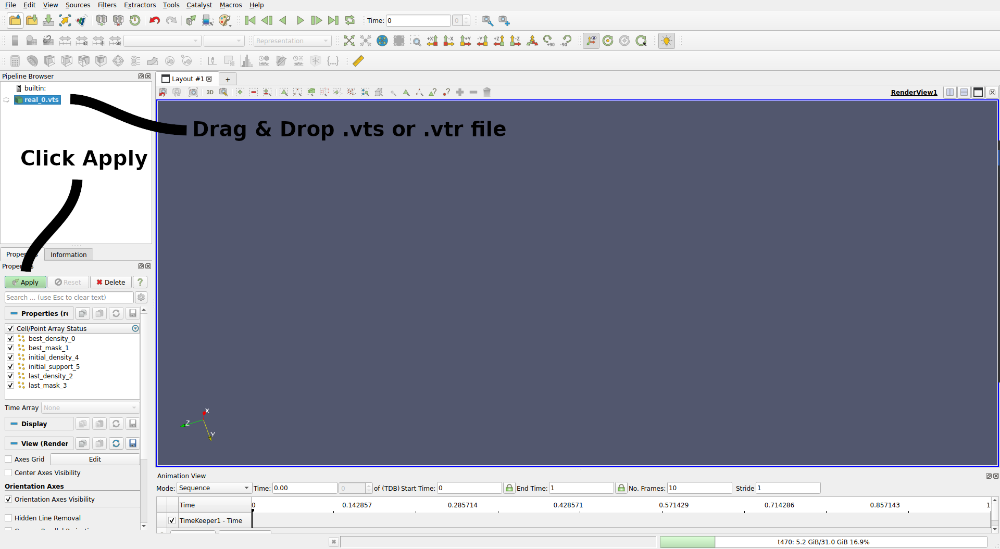
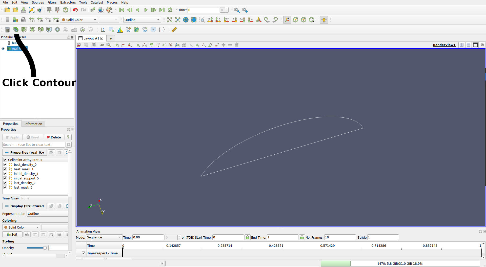
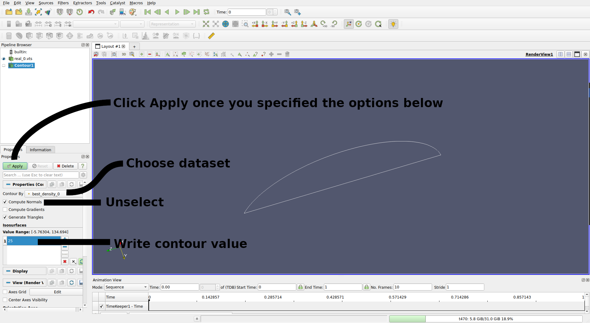
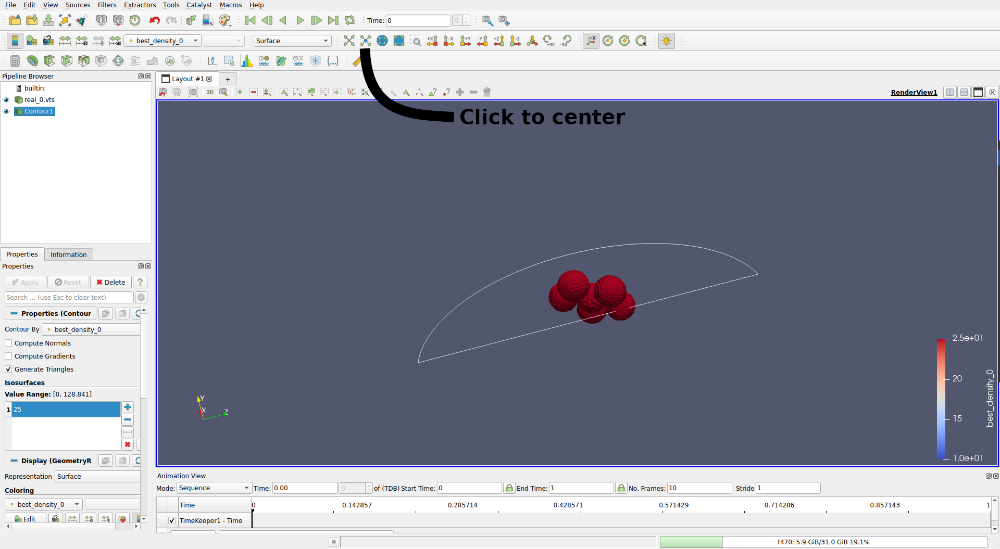
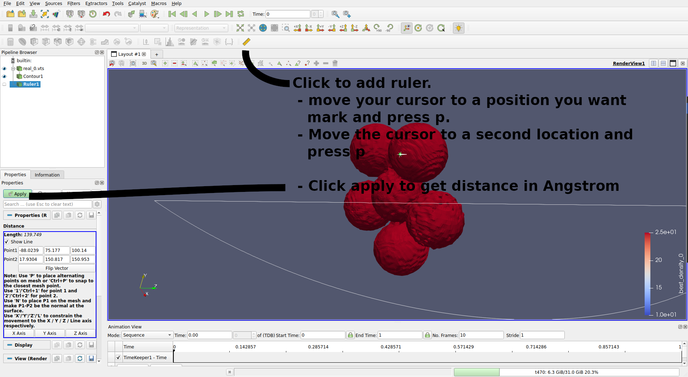
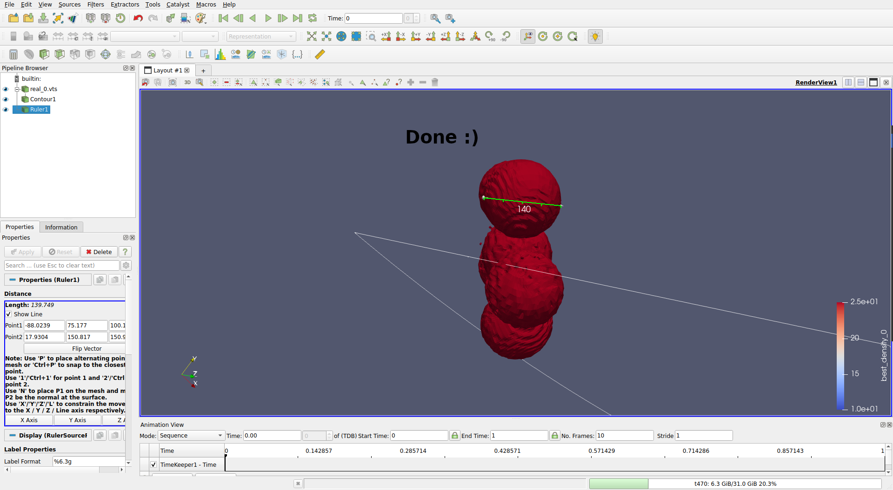

# Example usage of Paraview
The immage sequence below shows how to plot contour levels and measure distances.  
For detailed explanations visit the Paraview [users guide](https://docs.paraview.org/en/latest/Tutorials/SelfDirectedTutorial/basicUsage.html).  
{: style="width:100%",data-gallery="paraview" data-title='' data-description=''}
{: style="width:100%",data-gallery="paraview" data-title='' data-description=''}
{: style="width:100%",data-gallery="paraview" data-title='' data-description=''}
{: style="width:100%",data-gallery="paraview" data-title='' data-description=''}
{: style="width:100%",data-gallery="paraview" data-title='' data-description=''}
{: style="width:100%",data-gallery="paraview" data-title='' data-description=''}
